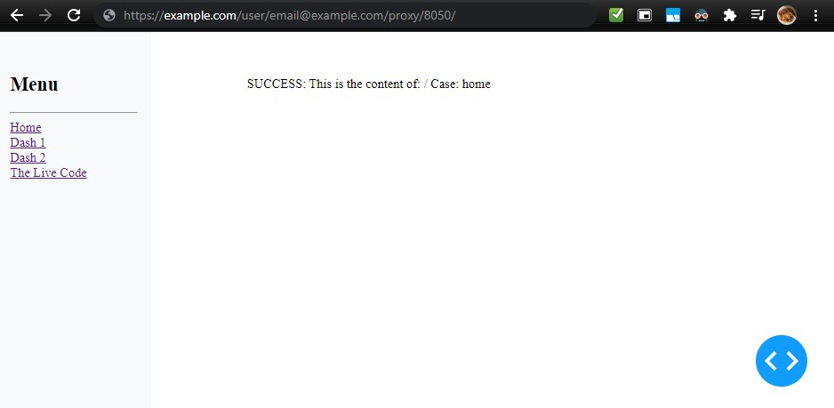
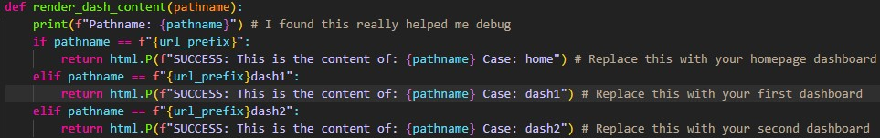

# Multipage Dash App

A Multipage dash app that is compatable with Jupyter Proxy.

This multipage dash app will run inside JupyterHub and allow external viewing by leveraging Jupyter Proxy.




### Attaching Dashboards

This example comes with placeholder text instead of 3 actual dashboards.

To attach your dashboards you can put them here:



_The dashboards are not the purpose of this repo, this is just a framework demonstrating how to host multiple dashboards with a menu to select between them._

### Environment Setup

Bash:
```
python3 -m venv .venv
source .venv/bin/activate
pip install -r requirements.txt
```

Windows:
```
python -m venv .venv
source .\.venv\scripts\activate
pip install -r requirements.txt
```


### Configuration

Set these for viewing externally:
```python
username='email@example.com'
url_prefix= f"/user/{username}/proxy/{port}/"
```

Or to view locally set it to:
```python
url_prefix= "/"
```

This leaves us where the whole local/external viewing is determined by `url_prefix` which is handy.


### Run Dash App

```bash
make run-windows # Assumes you have activated the venv and installed as above
make run-linux   # If you are running in a Linux environment
```

### View Externally

With the url_prefix set to the string used for external viewing, you can view the dash here:

https://example.com/user/{username}/proxy/{port}/

Example using the values in main:
https://example.com/user/email@example.com/proxy/8050/
